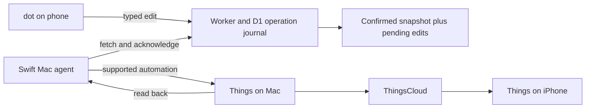

# Queued cloud writes and native Mac sync

Status: first implementation built and synthetically tested, October 1, 2026. Live cloud access remains read-only pending secure activation. The user authorized the native agent and automatic conflict priority. The implemented policy is Things wins on a changed field, with skipped cloud edits retained, rather than asking for manual conflict resolution.

The implementation and secure setup are in [mac-sync](../mac-sync/README.md). It supports queued title changes and task completion, source-preserving migration, journal recovery and scoped OAuth write access. The following design records the broader direction and API limits; later field types remain future work.

## User experience

For example, the owner tells dot to complete a task while travelling. The Worker durably records a typed operation and dot immediately shows the item as completion pending. The last confirmed Things value remains available underneath. When the Mac reconnects, the agent checks the target, applies the supported operation, re-reads Things and uploads a receipt plus a fresh snapshot. Only then can dot say the change was verified in Things. ThingsCloud and iPhone delivery remain a separate step, owned by Things.

Cloud acceptance is durable while the Mac is offline. It does not instantly update the Things iPhone app. The Mac must be awake, online, logged into its user session and able to run Things automation before local execution can happen. The system is a cloud operation journal with a Mac bridge, not a second ThingsCloud client.

## Conflict policy

Store each edited field's base value, desired value and record ID. Before executing, fetch a fresh complete inventory and re-read the target immediately before the write.

| Current Things value | Decision |
|---|---|
| Equals the saved base value | Apply this field, preserving all other fields |
| Already equals the desired value | Record the desired state as satisfied, without repeating the mutation |
| Differs from both | Keep both versions and mark conflict for owner resolution |
| Target is missing, trashed or its field is unsupported | Block the operation with a clear reason |

A local notes edit does not prevent a cloud title edit. Two different title edits automatically prefer the Things value, and the skipped cloud edit stays in the journal. New unclaimed cloud title edits supersede earlier queued title edits. A claimed operation cannot be replaced or stolen. Undo and cancellation remain future work; a later explicit edit is a new immutable operation.

Things' public automation does not provide an atomic compare-and-set against its cloud revision. An iPhone edit can arrive between the Mac's check and write, or after a read that has not yet caught up with ThingsCloud. Value comparisons also cannot detect an edit followed by a revert. Consequently, guaranteed conflict-free two-way sync is not achievable through these APIs. A best-effort field merge with visible conflicts is the honest promise. Preserve before/after values for recovery and flag unexpected subsequent divergence. Do not invent a reliable ThingsCloud freshness barrier.

The initial release should enable explicit task completion and title changes, with same-field conflicts blocked. Add creation, dates, tags and moves in separate verified slices. Notes replacement, recurrence, checklist replacement, bulk edits and permanent deletion require separate policies and capability work. A native agent cannot make unsupported Things fields become supported.

## Durable operations

The existing companion has useful immutable proposal, claim, audit and receipt patterns, but its Worker transport currently only uploads snapshots. Live queued writes require completing the D1 operation routes and MCP tools plus implementing the real Mac writer. Synthetic guarded-write tests do not establish live atomicity.

Use a unique operation ID and immutable payload. Cloud submission retries must return the original operation. Persist local intent before calling Things. Persist the verified receipt before acknowledging to the cloud. Restarting after a lost acknowledgement resends the receipt instead of rerunning the command. A crash between mutation and receipt is uncertain; preserve evidence and reconcile rather than blindly retrying or creating duplicates. One Mac agent may claim a stream at a time. Do not steal an expired claim while its execution outcome is unknown.

Suggested states: queued, executing, applied, conflict, failed, uncertain and cancelled. Reads must expose confirmed values, effective pending values, operation IDs, queue age, last Mac heartbeat and last confirmed sync. A periodic snapshot must never erase a queued edit. Bound operation and page sizes and batch D1 work for the current Worker tier.

Owner instructions such as an explicit completion request should be enough to submit that specific allowlisted operation. Do not force an extra generic approval click for every low-impact task edit. Ambiguous instructions need clarification. Sensitive or irreversible actions remain separate. The older exact-review approval workflow can remain available for larger proposals; it should not silently become a requirement for all ordinary edits.

## Native agent recommendation

Use Swift and AppKit/SwiftUI for this Mac-only job. A small menu-bar status app can own the reader, typed writer, HTTPS transport, wake/network handling and SQLite receipt journal. No Python subprocess should be needed in normal operation. Rust/Tauri can also do this, but introduces a web UI/runtime and bridging that this small agent does not currently need. This is a fit recommendation, not a measured memory comparison.

Install the app under Applications and store journals/configuration under `~/Library/Application Support/LifeOS`. Run at login in the user's session through the supported macOS login-item API. Poll with backoff and jitter, perform a refresh after wake and network recovery, and prevent overlapping runs. Let the Mac sleep normally. Show pending/conflicted counts, last successful sync, retry and pause controls. Do not request Documents/Desktop access or read Things' private database.

The current scheduled helper uses Python3.14 and a WorkingDirectory inside Documents. The owner initially described Documents/Desktop access, but their screenshot specifically says Python3.14 would like to access data from other apps. The original LifeOS adapter reads Things' private database and is a likely cause, not a confirmed attribution to the scheduled mirror. Moving paths alone cannot fix that category of access. Replace private database reads with supported automation, and keep the app's own files out of protected folders. Give the app a stable bundle ID and signing identity. Supported Things automation may still require a one-time user approval, and later revocation must be respected. A development build cannot promise that repeated permission prompts are eliminated until installed-build behaviour is tested.

Keep credentials out of source, argv, logs and chat. Choose app-scoped Keychain storage or an approved native 1Password integration during secure setup; do not copy existing secrets through agent tools. Define locked-keychain behaviour and show a quiet actionable status rather than repeated prompts. The current 1Password reference can remain with the old helper until a user-mediated credential migration is ready. Fix the earlier exposed GitHub client secret through secure rotation before expanding OAuth grants.

## Delivery sequence

1. Preserve source in the private repository and document the running deployment, paths and recovery state.
2. Build the native read-only agent and migrate the existing journal without resetting its stream sequence. Test wake, locked session, network failure, permissions and single-instance behaviour before replacing launchd.
3. Implement cloud queued operations and pending read overlays with synthetic concurrency, retry and recovery tests. Keep production execution disabled until the actual writer is verified.
4. Add and verify typed completion and title writes against disposable owner-created tasks. Test before/after inspection, independent-field edits, same-field conflict, restart after ambiguous execution and cloud acknowledgement loss.
5. Publish the verified Worker changes to the existing deployment, introduce a narrow write scope and reauthorize the existing app. A read grant must not gain write permission silently. Keep the Mac upload credential separate from dot's OAuth grant.
6. Verify a phone request with the Mac asleep, subsequent Mac execution, fresh cloud confirmation and Things iPhone visibility. Only this demonstrates the complete requested path.

Source control is not a replacement for backups of the D1 queue/audit or the Mac receipt journal. Before live writes, define encrypted backup retention and test a restore that does not replay old operations.

## Primary references

- [Things safe integration methods](https://culturedcode.com/things/support/articles/5510170/)
- [Things AppleScript commands](https://culturedcode.com/things/support/articles/4562654/)
- [Things URL scheme](https://culturedcode.com/things/support/articles/2803573/)
- [Apple automation usage description](https://developer.apple.com/documentation/bundleresources/information-property-list/nsappleeventsusagedescription)
