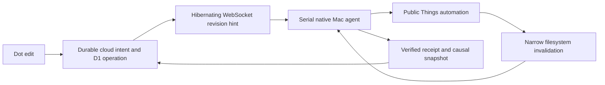

# Event-driven LifeOS sync

October 1, 2026. Selected through three Sol medium arena candidates and a Sol medium cross-judge, then implemented by three Sol medium swarm workers. See event-sync-arena.md for rollout evidence.

## Design

The Mac holds an authenticated outbound WebSocket. It does not periodically request the cloud queue or scan the inventory. Startup, reconnect, wake, network restoration, local changes and the local day boundary trigger work. One-shot failure retries use backoff. A sparse WebSocket ping detects broken connections; this does not mean zero network packets or battery cost.

Notifications contain a revision, never task data or executable instructions. The owner Durable Object journals FIFO enqueue intents before D1 mutations, saves prepared exact payloads, and retries unresolved outcomes. Committed revision advancement and intent retirement are atomic. Delivery recovery runs only while accepted work or connected unacknowledged delivery remains. Reconnect registers the socket before reading its watermark. There is no second D1 notification outbox.

The native engine retains dirty generations, drains runnable cloud operations before inventory reads, saves receipts before acknowledgement and replays exact interrupted uploads. Duplicate revision hints do not trigger new scans. An event during a scan retains another pass. A bounded child process bulk-reads public Things properties twice and compares complete canonical inventories. Content hashes suppress unchanged uploads.

FSEvents watches narrow Things metadata paths and coalesces changes for 500 milliseconds. It does not parse or modify the private database. Dropped events, directory replacement and wake trigger reconciliation. This is local invalidation, not an official Things webhook. Unsupported fields remain explicit and cannot be written.

## Authority and recovery

New cloud_wins operations override competing changes to their specific supported fields. Unrelated local fields survive, and displaced before/after values are retained in immutable audit receipts. Historical things_wins operations retain their original policy. A deployment flag prevents enabling cloud_wins before a compatible native app is installed.

Desired cloud fields are separate from confirmed Things observations. Overlays are not limited by the execution batch or recent receipt page. Retirement requires an applied receipt, a later snapshot sequence, a sufficient captured cloud revision and an actual matching observed value. An old saved snapshot cannot erase pending intent.

Interrupted setters inspect remote claim, immutable payload and current desired revision before replay. Newer desired intent supersedes the older setter. Interrupted Trash actions check membership and never blindly repeat deletion. Ambiguous results remain visible. No operation empties Trash.

## Measured reader result

The bracketed live parity run covered 55 records, including 45 task/project records. Both old scans agreed, and the new reader exactly matched IDs, supported cells, relationships, coverage metadata and ordering. Old: 14.948 seconds before and 14.928 seconds after. New: 1.782 seconds including child startup. About 8.4 times faster in one stable run, not a p95 guarantee.

## Primary sources

- [Cloudflare WebSocket hibernation](https://developers.cloudflare.com/durable-objects/best-practices/websockets/)
- [Apple URLSessionWebSocketTask](https://developer.apple.com/documentation/foundation/urlsessionwebsockettask)
- [Apple FSEvents and dropped-event handling](https://developer.apple.com/library/archive/documentation/Darwin/Conceptual/FSEvents_ProgGuide/UsingtheFSEventsFramework/UsingtheFSEventsFramework.html)
- [Things integration limits](https://culturedcode.com/things/support/articles/2967034/)
- [Things AppleScript](https://culturedcode.com/things/support/articles/4562654/)
- [Apple background push delivery limits](https://developer.apple.com/documentation/usernotifications/pushing-background-updates-to-your-app)

APNs was deferred because it needs additional provisioning and background delivery is not guaranteed. HTTP webhooks cannot directly reach a sleeping Mac behind an ordinary home network. Physical sleep/wake and iPhone propagation require separate observations.
