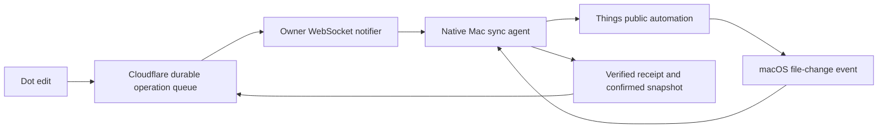

# Event-driven LifeOS sync proposal

Research and read-only measurements, October 1, 2026. This proposal has not replaced the deployed polling implementation.

## Measured bottleneck

The installed public automation reader took 18.709 seconds for 64 records in one live measurement:

| Work | Time |
| --- | --- |
| Classification before | 1.566 seconds |
| First full JXA scan | 7.109 seconds |
| Second full JXA scan | 7.036 seconds |
| Reader including process overhead | 14.211 seconds |
| Classification after | 2.932 seconds |

A separate AppleScript bulk-properties probe enumerated all public lists, project children, area children and top-level IDs. It covered 64 unique IDs, 74 observations and 18 child-collection batches in 0.443 seconds. A top-level-only probe covered just three records in 0.088 seconds, so that result alone would be misleading. These are collection probes, not a replacement canonical reader: reference conversion, class handling, unsupported fields and stable snapshot validation are still required. No speed guarantee is established for the finished replacement.

The current reader retrieves properties one record at a time through Apple Events and repeats the scan. Adding threads would not eliminate those calls or provide an atomic snapshot from Things. The immediate optimization is bulk public-property retrieval, cached relationship resolution and fewer cross-process calls while retaining complete inventory validation. Keep two cheap bulk passes until equivalent consistency protection is proven.

## Recommended architecture

Use an authenticated outbound `URLSessionWebSocketTask` from the Mac to one owner-scoped Cloudflare Durable Object using the Hibernation WebSocket API. It waits for events instead of issuing periodic pending requests. Cloudflare can retain the connected client while the Durable Object hibernates. There will still be network connection maintenance and reconnect attempts when a connection fails; this does not mean zero packets or zero battery use.

Send only a small invalidation message such as a monotonically increasing revision. The durable queue and existing receipt protocol remain authoritative. A WebSocket message is a hint to reconcile, never permission to execute arbitrary content or proof that a Things edit succeeded. Use the existing scoped native Keychain credential in an upgrade request header, never in a URL. The notifier must authorize the owner and support credential revocation.

On startup, reconnect, wake or network restoration, subscribe first and reconcile the durable revision once. Buffer incoming higher revisions during reconciliation. Persist the last acknowledged revision locally. Duplicate notifications are harmless; reconnect retrieves anything missed while offline. Disable ordinary 60-second sync timers and five-minute full inventory cycles. Use bounded one-shot retries only for actual failed work and reconnects, with backoff and jitter.

## Reliable publishing

A best-effort broadcast after a D1 write is insufficient: a crash after commit could leave a connected Mac unaware forever. Retain a transactional D1 change revision and notification outbox alongside each queued operation. Route cloud enqueue through the owner Durable Object. Before permitting the D1 mutation, durably record a pending enqueue intent with a stable operation ID and arm a recovery alarm. Commit the operation and outbox together, then broadcast and retire the outbox record. Recovery must retain and idempotently resolve or retry the pending intent until the D1 outcome is known, including a commit that finishes after the coordinator crashes. Merely arming an alarm before the write does not cover that race. If publish or acknowledgement fails, recovery delivers committed outbox work. A failed or unavailable coordinator must cause enqueue to retry rather than commit without a durable notification recovery path.

Server outbox recovery is separate from idle Mac polling. It runs only while delivery work is outstanding. A send acknowledgement proves the notification channel processed an event, not that the Mac applied a task. Native immutable receipts retain that distinction. Exercise crash points around alarm creation, D1 commit, publish and outbox acknowledgement before production rollout.

## Detecting local Things changes

Cultured Code documents local AppleScript, Shortcuts and URL integration but no public cloud API or change subscription. A local file-event watcher is therefore a proposed integration, not a supported Things webhook.

Use a narrowly scoped macOS FSEvents stream for the active Things data directory. Watch the directory and database write-ahead-log changes, not only the main SQLite file. Do not parse or modify the private database. The event only marks the public inventory dirty; supported automation still reads and writes task data. Filter out backups and unrelated files, coalesce bursts for roughly 0.5 to 1 second, then take one optimized public snapshot. If another event arrives during the scan, schedule one additional pass. Compare a canonical content hash and upload only actual changes.

Filesystem events can be dropped or coalesced. Retain the event cursor, rescan on dropped-event flags or directory replacement, and refresh on startup and wake. The watcher may need owner-approved access to another app's data. It must fail visibly if access is denied, rather than bypass privacy controls. A stable app signing identity matters for persistent macOS permissions. This should not revive Python or 1Password in the recurring path.

Calendar-derived lists can change at midnight without a task edit, so schedule a local day-boundary invalidation. That is one known change event, not periodic Cloudflare polling. If the storage layout or watcher fails after a Things update, report degraded sync and offer manual reconciliation. Do not silently reintroduce a polling fallback against the user's requirement.

## Cloudflare as the source of truth

Keep desired cloud state distinct from the last confirmed Things state. A phone edit changes desired state and remains pending until the Mac verifies it. Uploading an old Mac snapshot must never erase that desired edit.

The deployed version currently makes Things win same-field conflicts. The requested Cloudflare-authoritative model changes that rule: apply an explicit pending cloud edit to its target field even if that field also changed locally, while retaining the displaced local value in the audit journal. Preserve unrelated local fields. Ordinary local edits without competing cloud intent can be submitted as new cloud revisions. This policy change belongs in a tested migration, not an incidental performance patch. Cloudflare does not become the authority for unsupported Things fields.

## Work to implement and verify

1. Replace the reader with bulk public automation and prove identical record IDs, kinds, fields, relationships and complete-list coverage. Measure full conversion and validation, not just enumeration.
2. Separate cloud-queue execution from full inventory upload. Apply known queued edits immediately and verify their specific targets, then coalesce a background inventory reconciliation. Pending snapshots and receipts remain durable across restart.
3. Add the authenticated hibernating notifier with crash-safe outbox delivery and revision catch-up. Reuse the existing Worker, OAuth app, D1 queue and native identity.
4. Add the narrowly scoped local watcher, permission handling and content-hash deduplication. Prevent the agent's own write from creating an endless sync loop.
5. Remove periodic idle sync. Test idle request count, CPU wakeups, missed messages, duplicate messages, sleep/wake, offline edits, watcher replacement, interrupted writes and the explicitly selected cloud conflict rule.

Measure delivery latency separately from verified Things application latency. Targets are immediate cloud notification and a short debounced local reconciliation, but actual timing must be measured. A sleeping or disconnected Mac cannot apply Things automation until it reconnects. APNs is a later option for OS-managed delivery, but Apple's background delivery is not guaranteed and requires proper app provisioning; it does not solve the Things change-feed limitation.

## Primary sources

- [Cloudflare WebSockets and Durable Object hibernation](https://developers.cloudflare.com/durable-objects/best-practices/websockets/)
- [Apple URLSessionWebSocketTask](https://developer.apple.com/documentation/foundation/urlsessionwebsockettask)
- [Apple FSEvents usage and dropped-event handling](https://developer.apple.com/library/archive/documentation/Darwin/Conceptual/FSEvents_ProgGuide/UsingtheFSEventsFramework/UsingtheFSEventsFramework.html)
- [Things integration limits](https://culturedcode.com/things/support/articles/2967034/)
- [Things public AppleScript commands](https://culturedcode.com/things/support/articles/4562654/)
- [Apple background push delivery limits](https://developer.apple.com/documentation/usernotifications/pushing-background-updates-to-your-app)
